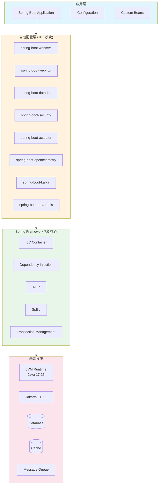
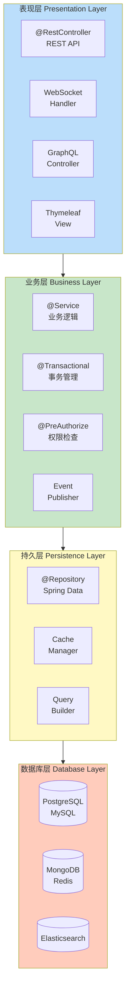
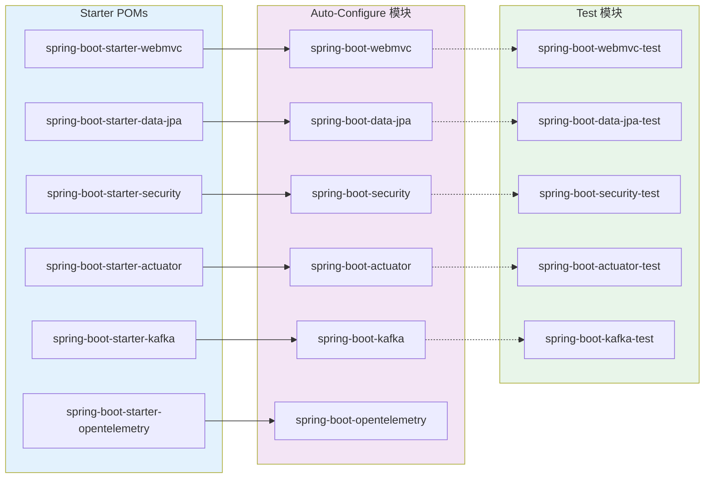
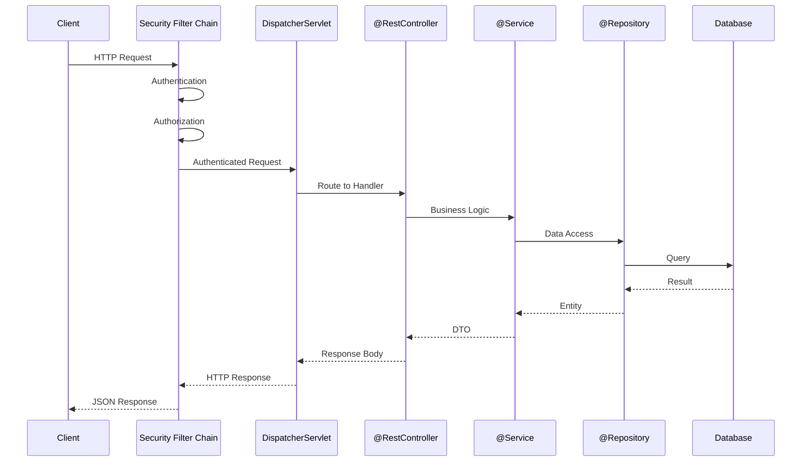
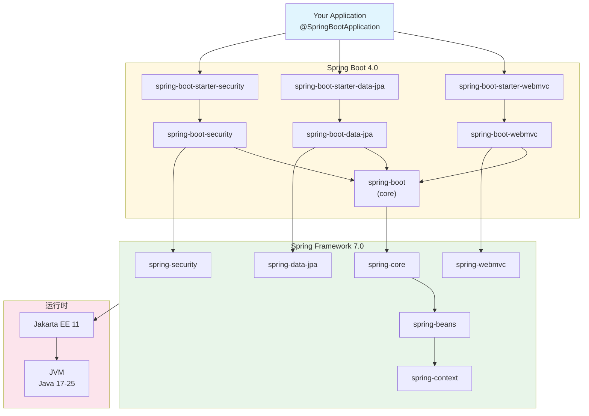
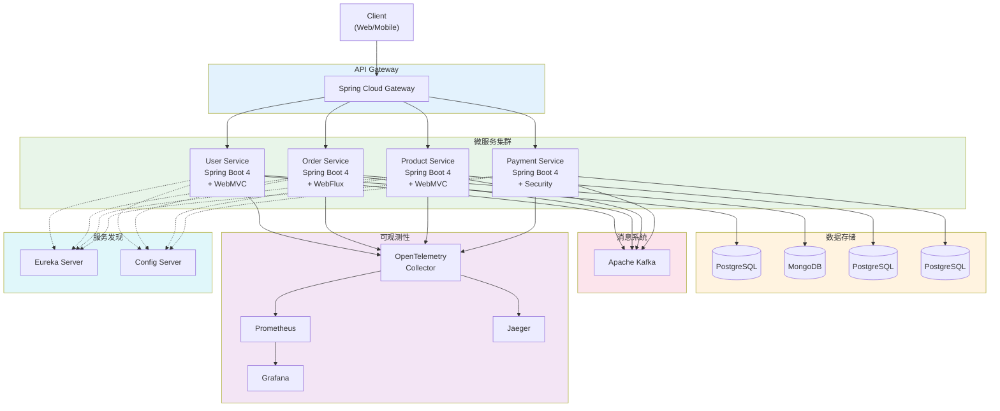
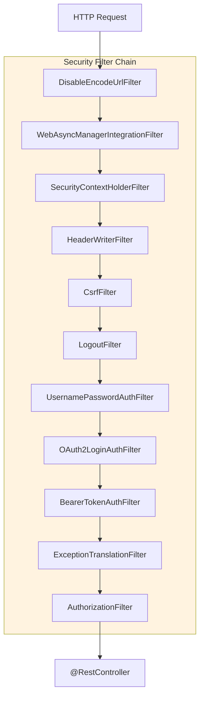
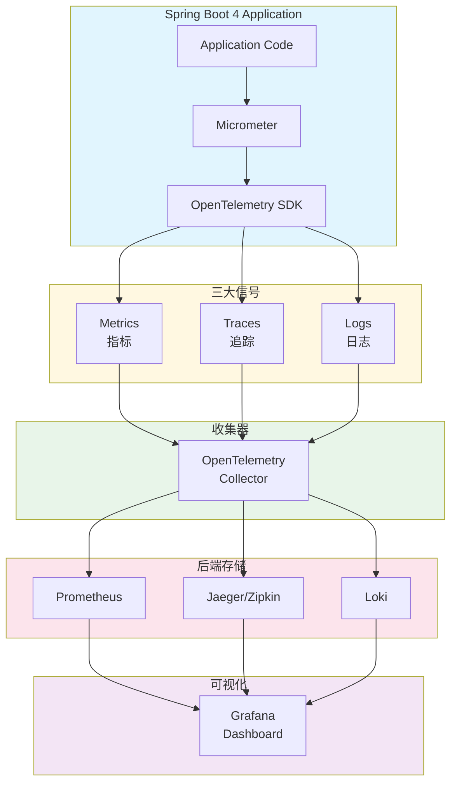
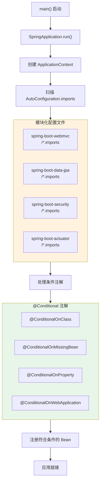
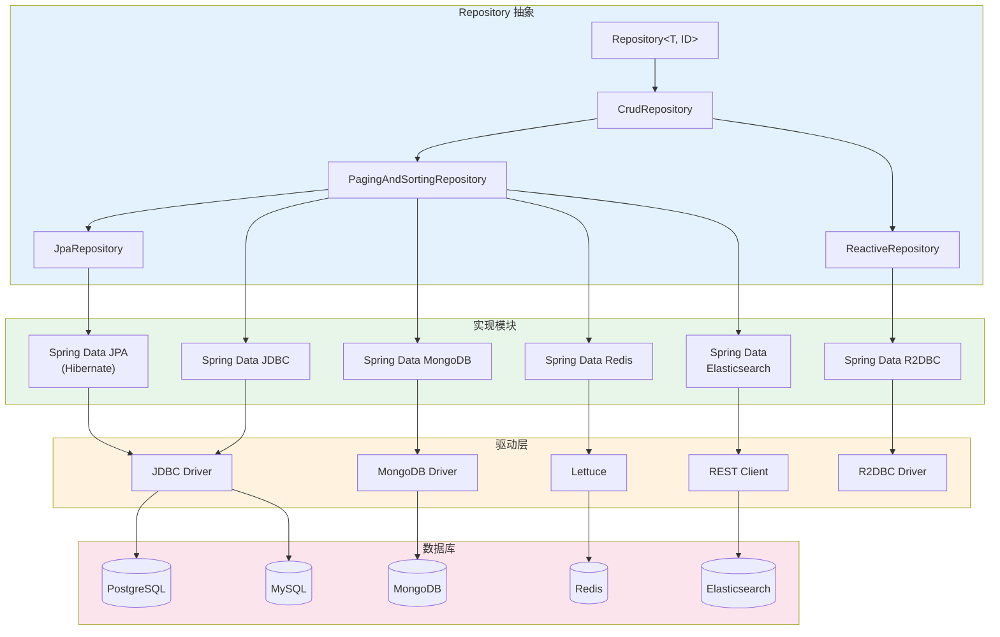

# Spring Boot 4.0 Mermaid 架构图

> 以下架构图使用 Mermaid 语法，可在支持 Mermaid 的 Markdown 预览器中渲染

## 一、整体架构图

## 二、四层架构图

## 三、模块化架构图

## 四、请求处理流程图

## 五、组件依赖关系图

## 六、微服务架构图

## 七、Spring Security 7.0 过滤器链

## 八、可观测性架构图

## 九、自动配置加载流程

## 十、数据访问架构图

