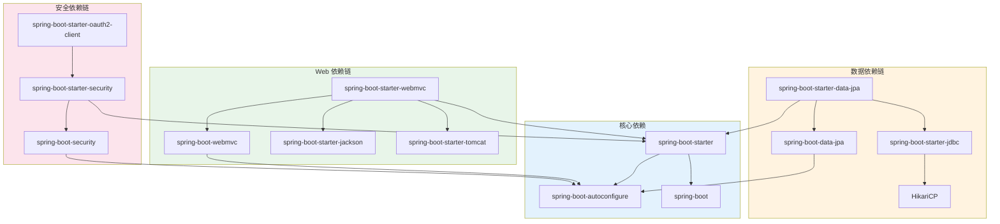

# Spring Boot 4.0 Starter 依赖关系

## 一、Starter 完整列表

### 1.1 核心 Starter

```
┌─────────────────────────────────────────────────────────────────────────────────┐
│                            核心 Starter                                         │
├─────────────────────────────────────────────────────────────────────────────────┤
│                                                                                 │
│  spring-boot-starter                    # 核心启动器，包含自动配置、日志等        │
│  spring-boot-starter-test               # 测试启动器                            │
│  spring-boot-starter-actuator           # 监控端点                              │
│  spring-boot-starter-aop                # AOP 支持                              │
│  spring-boot-starter-validation         # Bean Validation                       │
│  spring-boot-starter-cache              # 缓存抽象                              │
│  spring-boot-starter-logging            # 日志 (Logback)                        │
│  spring-boot-starter-log4j2             # Log4j2 日志                           │
│                                                                                 │
│  ─── 迁移支持 (过渡期) ───                                                       │
│  spring-boot-starter-classic            # 兼容旧版本行为                         │
│  spring-boot-starter-test-classic       # 测试兼容                              │
│                                                                                 │
└─────────────────────────────────────────────────────────────────────────────────┘
```

### 1.2 Web Starter

```
┌─────────────────────────────────────────────────────────────────────────────────┐
│                             Web Starter                                         │
├─────────────────────────────────────────────────────────────────────────────────┤
│                                                                                 │
│  spring-boot-starter-webmvc             # Spring MVC (替代原 starter-web)        │
│  spring-boot-starter-webmvc-test        # WebMVC 测试                           │
│  spring-boot-starter-webflux            # WebFlux 响应式                         │
│  spring-boot-starter-webflux-test       # WebFlux 测试                          │
│  spring-boot-starter-jersey             # JAX-RS                                │
│  spring-boot-starter-jersey-test        # Jersey 测试                           │
│  spring-boot-starter-websocket          # WebSocket                             │
│  spring-boot-starter-rsocket            # RSocket                               │
│  spring-boot-starter-graphql            # GraphQL                               │
│  spring-boot-starter-graphql-test       # GraphQL 测试                          │
│  spring-boot-starter-hateoas            # HATEOAS                               │
│                                                                                 │
└─────────────────────────────────────────────────────────────────────────────────┘
```

### 1.3 数据访问 Starter

```
┌─────────────────────────────────────────────────────────────────────────────────┐
│                          数据访问 Starter                                        │
├─────────────────────────────────────────────────────────────────────────────────┤
│                                                                                 │
│  ─── 关系型数据库 ───                                                            │
│  spring-boot-starter-data-jpa           # JPA (Hibernate)                       │
│  spring-boot-starter-data-jpa-test      # JPA 测试                              │
│  spring-boot-starter-data-jdbc          # JDBC                                  │
│  spring-boot-starter-data-jdbc-test     # JDBC 测试                             │
│  spring-boot-starter-data-r2dbc         # R2DBC 响应式                          │
│  spring-boot-starter-data-r2dbc-test    # R2DBC 测试                            │
│  spring-boot-starter-jooq               # jOOQ                                  │
│                                                                                 │
│  ─── NoSQL ───                                                                  │
│  spring-boot-starter-data-mongodb       # MongoDB                               │
│  spring-boot-starter-data-mongodb-reactive  # MongoDB 响应式                    │
│  spring-boot-starter-data-redis         # Redis                                 │
│  spring-boot-starter-data-redis-reactive    # Redis 响应式                      │
│  spring-boot-starter-data-elasticsearch # Elasticsearch                         │
│  spring-boot-starter-data-cassandra     # Cassandra                             │
│  spring-boot-starter-data-cassandra-reactive # Cassandra 响应式                 │
│  spring-boot-starter-data-neo4j         # Neo4j                                 │
│  spring-boot-starter-data-couchbase     # Couchbase                             │
│  spring-boot-starter-data-couchbase-reactive # Couchbase 响应式                 │
│                                                                                 │
│  ─── 其他数据 ───                                                                │
│  spring-boot-starter-data-ldap          # LDAP                                  │
│  spring-boot-starter-data-rest          # Spring Data REST                      │
│                                                                                 │
│  ─── 数据库迁移 ───                                                              │
│  spring-boot-starter-flyway             # Flyway                                │
│  spring-boot-starter-liquibase          # Liquibase                             │
│                                                                                 │
└─────────────────────────────────────────────────────────────────────────────────┘
```

### 1.4 消息 Starter

```
┌─────────────────────────────────────────────────────────────────────────────────┐
│                            消息 Starter                                         │
├─────────────────────────────────────────────────────────────────────────────────┤
│                                                                                 │
│  spring-boot-starter-amqp               # RabbitMQ                              │
│  spring-boot-starter-amqp-test          # AMQP 测试                             │
│  spring-boot-starter-kafka              # Apache Kafka                          │
│  spring-boot-starter-kafka-test         # Kafka 测试                            │
│  spring-boot-starter-pulsar             # Apache Pulsar                         │
│  spring-boot-starter-pulsar-test        # Pulsar 测试                           │
│  spring-boot-starter-pulsar-reactive    # Pulsar 响应式                         │
│  spring-boot-starter-artemis            # ActiveMQ Artemis                      │
│  spring-boot-starter-activemq           # ActiveMQ                              │
│  spring-boot-starter-integration        # Spring Integration                    │
│                                                                                 │
└─────────────────────────────────────────────────────────────────────────────────┘
```

### 1.5 安全 Starter

```
┌─────────────────────────────────────────────────────────────────────────────────┐
│                            安全 Starter                                         │
├─────────────────────────────────────────────────────────────────────────────────┤
│                                                                                 │
│  spring-boot-starter-security           # Spring Security 7.0                   │
│  spring-boot-starter-security-test      # Security 测试                         │
│  spring-boot-starter-oauth2-client      # OAuth2 客户端                         │
│  spring-boot-starter-oauth2-resource-server  # OAuth2 资源服务器                │
│  spring-boot-starter-oauth2-authorization-server # OAuth2 授权服务器            │
│  spring-boot-starter-ldap               # LDAP                                  │
│  spring-boot-starter-session            # Spring Session                        │
│                                                                                 │
└─────────────────────────────────────────────────────────────────────────────────┘
```

### 1.6 可观测性 Starter

```
┌─────────────────────────────────────────────────────────────────────────────────┐
│                          可观测性 Starter                                        │
├─────────────────────────────────────────────────────────────────────────────────┤
│                                                                                 │
│  spring-boot-starter-actuator           # Actuator 端点                         │
│  spring-boot-starter-actuator-test      # Actuator 测试                         │
│  spring-boot-starter-opentelemetry      # OpenTelemetry (新增!)                 │
│                                                                                 │
└─────────────────────────────────────────────────────────────────────────────────┘
```

### 1.7 其他 Starter

```
┌─────────────────────────────────────────────────────────────────────────────────┐
│                            其他 Starter                                         │
├─────────────────────────────────────────────────────────────────────────────────┤
│                                                                                 │
│  ─── 批处理/任务 ───                                                             │
│  spring-boot-starter-batch              # Spring Batch                          │
│  spring-boot-starter-batch-test         # Batch 测试                            │
│  spring-boot-starter-quartz             # Quartz 调度                           │
│                                                                                 │
│  ─── 模板引擎 ───                                                                │
│  spring-boot-starter-thymeleaf          # Thymeleaf                             │
│  spring-boot-starter-freemarker         # FreeMarker                            │
│  spring-boot-starter-mustache           # Mustache                              │
│  spring-boot-starter-groovy-templates   # Groovy Templates                      │
│                                                                                 │
│  ─── JSON/序列化 ───                                                             │
│  spring-boot-starter-jackson            # Jackson 3.0                           │
│  spring-boot-starter-gson               # Gson                                  │
│  spring-boot-starter-jsonb              # JSON-B                                │
│  spring-boot-starter-kotlin-serialization # Kotlin 序列化 (新增!)               │
│                                                                                 │
│  ─── 工具 ───                                                                    │
│  spring-boot-starter-mail               # 邮件                                  │
│  spring-boot-starter-webservices        # Web Services (SOAP)                   │
│  spring-boot-starter-docker-compose     # Docker Compose 集成                   │
│  spring-boot-starter-testcontainers     # Testcontainers                        │
│                                                                                 │
└─────────────────────────────────────────────────────────────────────────────────┘
```

## 二、Starter 依赖关系图



## 三、常用组合推荐

### 3.1 RESTful API 项目

```xml
<dependencies>
    <!-- Web -->
    <dependency>
        <groupId>org.springframework.boot</groupId>
        <artifactId>spring-boot-starter-webmvc</artifactId>
    </dependency>

    <!-- 数据访问 -->
    <dependency>
        <groupId>org.springframework.boot</groupId>
        <artifactId>spring-boot-starter-data-jpa</artifactId>
    </dependency>

    <!-- 安全 -->
    <dependency>
        <groupId>org.springframework.boot</groupId>
        <artifactId>spring-boot-starter-security</artifactId>
    </dependency>

    <!-- 可观测性 -->
    <dependency>
        <groupId>org.springframework.boot</groupId>
        <artifactId>spring-boot-starter-actuator</artifactId>
    </dependency>
    <dependency>
        <groupId>org.springframework.boot</groupId>
        <artifactId>spring-boot-starter-opentelemetry</artifactId>
    </dependency>

    <!-- 验证 -->
    <dependency>
        <groupId>org.springframework.boot</groupId>
        <artifactId>spring-boot-starter-validation</artifactId>
    </dependency>

    <!-- 测试 -->
    <dependency>
        <groupId>org.springframework.boot</groupId>
        <artifactId>spring-boot-starter-webmvc-test</artifactId>
        <scope>test</scope>
    </dependency>
    <dependency>
        <groupId>org.springframework.boot</groupId>
        <artifactId>spring-boot-starter-data-jpa-test</artifactId>
        <scope>test</scope>
    </dependency>
    <dependency>
        <groupId>org.springframework.boot</groupId>
        <artifactId>spring-boot-starter-security-test</artifactId>
        <scope>test</scope>
    </dependency>
</dependencies>
```

### 3.2 响应式项目

```xml
<dependencies>
    <!-- WebFlux -->
    <dependency>
        <groupId>org.springframework.boot</groupId>
        <artifactId>spring-boot-starter-webflux</artifactId>
    </dependency>

    <!-- 响应式数据访问 -->
    <dependency>
        <groupId>org.springframework.boot</groupId>
        <artifactId>spring-boot-starter-data-r2dbc</artifactId>
    </dependency>
    <dependency>
        <groupId>org.springframework.boot</groupId>
        <artifactId>spring-boot-starter-data-redis-reactive</artifactId>
    </dependency>

    <!-- 安全 -->
    <dependency>
        <groupId>org.springframework.boot</groupId>
        <artifactId>spring-boot-starter-security</artifactId>
    </dependency>

    <!-- 测试 -->
    <dependency>
        <groupId>org.springframework.boot</groupId>
        <artifactId>spring-boot-starter-webflux-test</artifactId>
        <scope>test</scope>
    </dependency>
</dependencies>
```

### 3.3 微服务项目

```xml
<dependencies>
    <!-- Web -->
    <dependency>
        <groupId>org.springframework.boot</groupId>
        <artifactId>spring-boot-starter-webmvc</artifactId>
    </dependency>

    <!-- 消息 -->
    <dependency>
        <groupId>org.springframework.boot</groupId>
        <artifactId>spring-boot-starter-kafka</artifactId>
    </dependency>

    <!-- 缓存 -->
    <dependency>
        <groupId>org.springframework.boot</groupId>
        <artifactId>spring-boot-starter-data-redis</artifactId>
    </dependency>
    <dependency>
        <groupId>org.springframework.boot</groupId>
        <artifactId>spring-boot-starter-cache</artifactId>
    </dependency>

    <!-- 可观测性 -->
    <dependency>
        <groupId>org.springframework.boot</groupId>
        <artifactId>spring-boot-starter-actuator</artifactId>
    </dependency>
    <dependency>
        <groupId>org.springframework.boot</groupId>
        <artifactId>spring-boot-starter-opentelemetry</artifactId>
    </dependency>

    <!-- 测试 -->
    <dependency>
        <groupId>org.springframework.boot</groupId>
        <artifactId>spring-boot-starter-webmvc-test</artifactId>
        <scope>test</scope>
    </dependency>
    <dependency>
        <groupId>org.springframework.boot</groupId>
        <artifactId>spring-boot-starter-kafka-test</artifactId>
        <scope>test</scope>
    </dependency>
</dependencies>
```

### 3.4 批处理项目

```xml
<dependencies>
    <!-- Batch -->
    <dependency>
        <groupId>org.springframework.boot</groupId>
        <artifactId>spring-boot-starter-batch</artifactId>
    </dependency>

    <!-- 数据访问 -->
    <dependency>
        <groupId>org.springframework.boot</groupId>
        <artifactId>spring-boot-starter-data-jdbc</artifactId>
    </dependency>

    <!-- 调度 -->
    <dependency>
        <groupId>org.springframework.boot</groupId>
        <artifactId>spring-boot-starter-quartz</artifactId>
    </dependency>

    <!-- 测试 -->
    <dependency>
        <groupId>org.springframework.boot</groupId>
        <artifactId>spring-boot-starter-batch-test</artifactId>
        <scope>test</scope>
    </dependency>
</dependencies>
```

## 四、从 Spring Boot 3.x 迁移

### 4.1 Starter 名称变更

| 3.x 名称 | 4.0 名称 | 说明 |
|---------|---------|------|
| `spring-boot-starter-web` | `spring-boot-starter-webmvc` | 更明确的命名 |
| `spring-boot-starter-test` | 各技术对应的 `-test` starter | 模块化测试 |
| - | `spring-boot-starter-opentelemetry` | 新增 |
| - | `spring-boot-starter-kotlin-serialization` | 新增 |

### 4.2 迁移步骤

```
┌─────────────────────────────────────────────────────────────────────────────────┐
│                            迁移步骤                                              │
├─────────────────────────────────────────────────────────────────────────────────┤
│                                                                                 │
│  步骤 1: 更新 parent 版本                                                        │
│  ─────────────────────────────────────────────                                  │
│  <parent>                                                                       │
│      <groupId>org.springframework.boot</groupId>                                │
│      <artifactId>spring-boot-starter-parent</artifactId>                        │
│      <version>4.0.0</version>                                                   │
│  </parent>                                                                      │
│                                                                                 │
│  步骤 2: 替换 starter-web 为 starter-webmvc                                      │
│  ─────────────────────────────────────────────                                  │
│  - <artifactId>spring-boot-starter-web</artifactId>                             │
│  + <artifactId>spring-boot-starter-webmvc</artifactId>                          │
│                                                                                 │
│  步骤 3: 添加对应的测试 starter                                                   │
│  ─────────────────────────────────────────────                                  │
│  <dependency>                                                                   │
│      <groupId>org.springframework.boot</groupId>                                │
│      <artifactId>spring-boot-starter-webmvc-test</artifactId>                   │
│      <scope>test</scope>                                                        │
│  </dependency>                                                                  │
│                                                                                 │
│  步骤 4: 修复 import 语句                                                        │
│  ─────────────────────────────────────────────                                  │
│  IDE 通常会自动建议正确的 import                                                  │
│                                                                                 │
│  步骤 5: 运行测试验证                                                            │
│  ─────────────────────────────────────────────                                  │
│  mvn clean test                                                                 │
│                                                                                 │
└─────────────────────────────────────────────────────────────────────────────────┘
```

### 4.3 使用 Classic Starter (过渡方案)

如果需要渐进式迁移：

```xml
<!-- 保持与 Boot 3.x 相似的行为 -->
<dependency>
    <groupId>org.springframework.boot</groupId>
    <artifactId>spring-boot-starter-classic</artifactId>
</dependency>

<dependency>
    <groupId>org.springframework.boot</groupId>
    <artifactId>spring-boot-starter-test-classic</artifactId>
    <scope>test</scope>
</dependency>
```

## 五、版本兼容性矩阵

| Spring Boot | Spring Framework | Java | Jakarta EE | Kotlin |
|-------------|-----------------|------|------------|--------|
| 4.0.x | 7.0.x | 17-25 | 11 | 2.2+ |
| 3.4.x | 6.2.x | 17-24 | 10 | 1.9+ |
| 3.3.x | 6.1.x | 17-23 | 10 | 1.9+ |
| 3.2.x | 6.1.x | 17-21 | 10 | 1.9+ |

## 六、参考资源

- [Spring Boot 4.0.0 发布公告](https://spring.io/blog/2025/11/20/spring-boot-4-0-0-available-now/)
- [Spring Boot 4.0 Release Notes](https://github.com/spring-projects/spring-boot/wiki/Spring-Boot-4.0-Release-Notes)
- [Spring Boot 4.0 Migration Guide](https://github.com/spring-projects/spring-boot/wiki/Spring-Boot-4.0-Migration-Guide)
- [Modularizing Spring Boot](https://spring.io/blog/2025/10/28/modularizing-spring-boot/)
